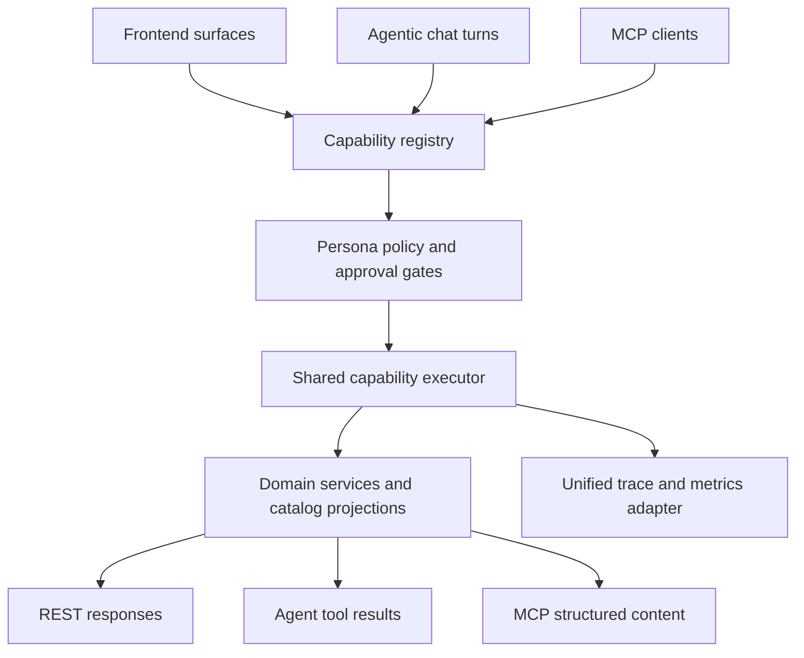

# refactor: Rationalize agent, API, and MCP capability parity

## Summary

Create one backend capability contract for shopper, associate, merchandiser, executive, and catalog-admin personas, then make frontend chat, REST APIs, admin assistant workflows, and MCP tools consume that contract through shared execution and observability pipes.

---

## Problem Frame

The backend already has strong pieces: public catalog/chat routes, Catalog Studio admin routes, API trace capture, Strands storefront agent tooling, and a broad MCP operator surface. They are not yet organized around one capability map. Storefront chat has an agent path for public shopping requests, while most admin and MCP actions execute service functions directly. This creates inconsistent user experience, uneven persona boundaries, and no single API/MCP parity checklist.

---

## Requirements

**Capability contract**

- R1. Define a versioned capability registry that names every persona, allowed operation, input schema, output schema, side-effect level, and approval requirement.
- R2. Map each frontend UI action, REST endpoint, admin assistant workflow, and MCP tool to one registry entry or mark it intentionally out of scope.
- R3. Separate shopper, associate, merchandiser, executive, catalog-admin, developer-trace, and send-capable capabilities before any remote MCP exposure.

**Shared execution**

- R4. Route agentic chat and direct API/MCP calls through shared service primitives so they use the same data projections, validation, and authorization decisions.
- R5. Preserve deterministic endpoints for simple reads and writes, but make their capability identity and traces match the agent path.
- R6. Keep public shopper data scoped to published catalog, linked customer identity, and backend-derived customer IDs.

**Observability and contracts**

- R7. Emit comparable trace spans, tool-call records, latency metrics, and selected-capability metadata across storefront chat, admin workflows, REST APIs, and MCP tools.
- R8. Publish a cohesive frontend OpenAPI/spec bundle that distinguishes public shopper APIs from admin/operator APIs and includes chat capability metadata.
- R9. Add parity tests that fail when a new UI/API/MCP action lacks a capability registry mapping, persona policy, prompt/tool exposure, or trace coverage.

---

## Key Technical Decisions

- KTD1. Capability registry before endpoint refactors: the registry makes persona policy and API/MCP parity auditable before code is moved.
- KTD2. Shared service primitives, not MCP-as-source-of-truth: MCP should mirror backend capabilities, while REST and agent chat should call the same service layer directly.
- KTD3. Agent loop as an execution mode: simple reads may remain deterministic, but all surfaces should report the same `capability_id`, `persona`, `selected_tool`, and trace topology.
- KTD4. Persona-scoped bundles over one global MCP server surface: a remote MCP client should receive only the tools allowed for its actor and session.
- KTD5. Registry-generated docs and tests: the frontend API spec, MCP tool inventory, and parity tests should derive from the same metadata instead of drifting by hand.

---

## High-Level Technical Design

---

## Implementation Units

### U1. Capability Registry And Persona Policy

- **Goal:** Introduce a registry module that enumerates capability IDs, personas, operation type, side-effect level, approvals, service handler, public REST exposure, MCP exposure, and trace tags.
- **Files:** `app/services/capabilities.py`, `app/services/auth/admin.py`, `app/services/auth/clerk.py`, `tests/test_capability_registry.py`.
- **Patterns:** Follow the existing admin allowlist and chat identity split in `app/services/auth/admin.py` and `app/services/auth/clerk.py`.
- **Test Scenarios:** Verify shopper cannot access store/admin/customer lookup capabilities; verify catalog-admin can access Catalog Studio operations; verify send-capable tools require an explicit approval flag and a send-capable policy.

### U2. REST/API Surface Mapping

- **Goal:** Map public catalog/chat routes, Catalog Studio routes, legacy `/admin` routes, `/recommendations/*`, and trace routes to registry capabilities.
- **Files:** `app/main.py`, `app/routers/catalog.py`, `app/routers/chat.py`, `app/routers/admin_catalog.py`, `app/routers/admin_synthetic.py`, `app/routers/recommendations.py`, `app/routers/api_traces.py`, `tests/test_frontend_api_contract.py`.
- **Patterns:** Keep public catalog routes on published normalized projections and keep chat customer identity backend-derived.
- **Test Scenarios:** Verify OpenAPI includes expected security for admin routes; verify legacy/operator routes are marked non-public; verify public shopper paths expose no customer ID input.

### U3. Shared Agent/Tool Execution Layer

- **Goal:** Move tool selection, auth gating, execution, trace annotation, and response shaping behind a reusable executor used by storefront chat and future admin chat.
- **Files:** `app/services/chat/orchestrator.py`, `app/services/chat/strands_orchestrator.py`, `app/services/chat/strands_tools.py`, `app/services/capability_executor.py`, `tests/test_chat_api.py`, `tests/test_catalog_voice_tools.py`.
- **Patterns:** Preserve the current `api_trace_session`, `api_trace_operation`, and LLMObs spans, but attach registry metadata to every step.
- **Test Scenarios:** Verify deterministic and Strands paths emit the same capability ID for equivalent public catalog questions; verify authenticated customer requests derive customer identity from the token; verify admin assistant calls produce the same trace shape.

### U4. MCP Tool Rationalization

- **Goal:** Split MCP tools into persona-scoped bundles backed by registry entries, reduce wrapper duplication, and expose only approved tools for each actor.
- **Files:** `app/mcp_server.py`, `scripts/mcp_smoke.py`, `tests/test_operator_workflows.py`.
- **Patterns:** Keep `fashion_catalog_search` and `fashion_catalog_product_detail` as public catalog exemplars because they already use the normalized published catalog.
- **Test Scenarios:** Verify anonymous/public MCP only exposes catalog discovery; verify associate bundle can prepare drafts but not send without approval; verify executive/admin bundles do not appear to shopper contexts.

### U5. Unified Specs And Capability Map

- **Goal:** Generate a human-readable capability map and update frontend API docs from registry metadata.
- **Files:** `docs/frontend-api.md`, `docs/frontend-openapi.yaml`, `docs/openapi.json`, `scripts/export_openapi.py`, `docs/capability-map.md`.
- **Patterns:** Continue using generated FastAPI schema exports, then layer capability metadata and persona boundaries into docs.
- **Test Scenarios:** Verify generated docs include every registry entry exposed to frontend/MCP; verify stale docs fail when registered routes are missing from the published spec.

### U6. Trace And Performance Unification

- **Goal:** Ensure REST, chat, admin assistant, and MCP executions record comparable trace topology, tool metadata, latency, error, and replay fields.
- **Files:** `app/api_traces/operations.py`, `app/api_traces/service.py`, `app/api_traces/adapters.py`, `app/routers/api_traces.py`, `app/mcp_server.py`, `tests/test_api_trace_*.py`, `tests/test_llm_otel.py`.
- **Patterns:** Extend existing API trace capture rather than adding a separate telemetry path.
- **Test Scenarios:** Verify each persona/surface produces `capability_id`, `persona`, `surface`, `selected_tool`, latency, and result status; verify trace export redacts customer and draft content.

---

## Scope Boundaries

- This plan does not rewrite all admin business logic at once.
- This plan does not expose `/mcp` publicly until persona policy and tool filtering are implemented.
- This plan does not remove deterministic REST endpoints; it makes them contract-aware and trace-compatible.
- This plan does not replace existing Catalog Studio workflow safety checks.

---

## Acceptance Examples

- AE1. Given an anonymous shopper asks for product details through `/api/chat`, the frontend product endpoint, or public MCP catalog detail, each path reads the same published catalog projection and reports the same capability ID.
- AE2. Given a signed-in shopper asks for order history, the backend derives customer identity from Clerk and rejects any caller-supplied `customer_id`.
- AE3. Given an administrator uses Catalog Studio assistant tooling, the call runs under the same capability executor and trace vocabulary as storefront chat instead of bypassing the agent/tool path entirely.
- AE4. Given a new admin UI action is added without a registry mapping and parity test, CI fails with the missing capability.
- AE5. Given remote MCP is enabled, the client receives only the persona-scoped tools for that identity and cannot invoke send-capable tools without explicit approval.

---

## Risks And Dependencies

- Broad tool surface risk: `app/mcp_server.py` contains many operator tools and should be split incrementally to avoid breaking ChatGPT Apps SDK widgets.
- Contract churn risk: frontend consumers may depend on existing `/api/admin/catalog/v2` and `/api/admin/catalog/v3` paths, so the registry should describe aliases before deprecations.
- Auth risk: MCP host/origin validation is not user authorization; remote exposure must wait for an identity and tool-permission layer.
- Observability risk: trace payload capture must preserve existing redaction limits before expanding to MCP and admin assistant paths.

---

## Sources And Research

- `app/services/chat/orchestrator.py` has a storefront chat pipeline with auth gating, deterministic fallback, optional Strands execution, and API trace session wrapping.
- `app/services/chat/strands_orchestrator.py` runs `StorefrontShoppingAgent` only for public storefront shopping tools.
- `app/mcp_server.py` defines one broad FastMCP server and many operator tools, with public catalog search/detail already using normalized published catalog data.
- `app/routers/admin_catalog.py` protects Catalog Studio routes with `require_catalog_admin` and contains workflow, realtime, suggestion, image, and publish endpoints.
- `app/services/auth/admin.py` distinguishes admin authorization and trace binding; `app/services/auth/clerk.py` distinguishes anonymous, authenticated-unlinked, and authenticated-customer chat identity.
- `README.md` documents that `/mcp` is local-only by default and needs explicit identity and tool-permission boundaries before remote use.
