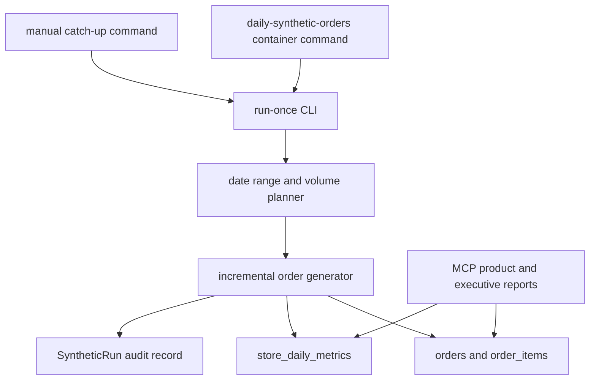

# feat: Add daily synthetic order volume refresh

## Summary

Add a small, container-friendly daily job that appends synthetic orders and order items against the existing store, customer, and product base. The job should keep MCP product, merchandising, and executive reports current without rerunning the full synthetic dataset or growing customer/product counts by default.

---

## Problem Frame

The current synthetic data flow is built for full dataset generation and load. That works for resets, but the load path clears synthetic tables and the generator uses deterministic IDs such as `ord_0000001`, so it is not suitable for daily appends. Product reports read rolling windows from `orders` and `order_items`; when loaded data is two or three months old, those windows look empty or stale even though the catalog remains usable.

---

## Requirements

**Daily order generation**

- R1. Generate orders for missing calendar dates after the latest loaded order date, with a one-time catch-up mode for stale environments.
- R2. Reuse existing stores, customers, products, loyalty weighting, product season matching, basket sizing, discounts, returns, channels, and occasions where possible.
- R3. Keep daily order volume modest, seasonally shaped, and bounded by configurable minimum and maximum values.
- R4. Make reruns idempotent for a target date or date range so a failed or repeated job does not duplicate orders.

**Data integrity**

- R5. Insert `orders` and `order_items` with date-scoped IDs that cannot collide with full-run synthetic IDs or prior daily runs.
- R6. Create a `SyntheticRun` record per daily/backfill batch and link appended rows through `seed_run_id`.
- R7. Refresh `store_daily_metrics` for appended order dates so executive trend views stay aligned with order-derived reports.
- R8. Avoid creating new customers by default and keep optional new product generation out of the first implementation unless a weekly product-drop flag is enabled later.

**Operations**

- R9. Run inside the existing deployed container image and Compose deployment without adding Redis, Celery, Kubernetes, or an external scheduler stack.
- R10. Expose a safe run-once CLI for manual catch-up and a lightweight always-on scheduler command for daily production use.
- R11. Log generated date ranges, order counts, skipped dates, validation failures, and latest loaded order date.

---

## Key Technical Decisions

- KTD1. DB-native append instead of CSV load: `load_entity_csv` resets synthetic tables and current order IDs collide across runs, so the daily path should insert ORM rows directly.
- KTD2. Existing customer base by default: reports need fresh behavior, not a fast-growing shopper universe, so customer creation stays out of scope for the first pass.
- KTD3. Seasonality from the existing generator: use `_month_order_multiplier`, `_daily_order_weight`, `_occasion_for_month`, and `_season_match_multiplier` from `app/services/synthetic_generator.py` to keep daily volume consistent with the full dataset.
- KTD4. Latest-order catch-up gate: the scheduled job should fill dates after `max(Order.ordered_at)` and skip dates already present, which handles stale data and protects reruns.
- KTD5. Same image, tiny scheduler loop: add a shell entrypoint that sleeps until the configured daily time and invokes the run-once command, avoiding new infrastructure.

---

## High-Level Technical Design

The run-once command should choose target dates from the latest loaded order date through the configured end date. For each date, it computes a bounded order count from the observed baseline, month multiplier, weekday factor, and a deterministic seed derived from the date.

---

## Implementation Units

### U1. Incremental Order Generation Service

- **Goal:** Add a service that reads active stores, customers, and products from Postgres and generates daily `Order` and `OrderItem` rows without materializing full CSV datasets.
- **Files:** `app/services/daily_synthetic_orders.py`, `app/services/synthetic_generator.py`, `tests/test_daily_synthetic_orders.py`.
- **Patterns:** Reuse the seasonal helpers and basket logic in `app/services/synthetic_generator.py`; follow the DB session style used by `app/services/index_jobs.py` and `app/services/image_jobs.py`.
- **Test Scenarios:** Verify generated rows have valid store, customer, and product foreign keys; verify IDs include the target date and do not collide with `ord_0000001` style IDs; verify customer selection weights loyalty tiers without creating new customers; verify products are weighted by store, category, availability, and season.

### U2. Volume Planner And Catch-Up Rules

- **Goal:** Compute target dates and daily order counts from existing data, with bounded catch-up behavior for stale deployments.
- **Files:** `app/services/daily_synthetic_orders.py`, `app/config.py`, `tests/test_daily_synthetic_orders.py`.
- **Patterns:** Match the 24-month generator's order calendar in `app/services/synthetic_generator.py` and use current report lookbacks from `app/services/product_performance.py`.
- **Test Scenarios:** Verify December volume is higher than November and both exceed January/February using the same seed; verify a weekday/weekend factor affects the count without breaching min/max bounds; verify a database that is 90 days stale plans a bounded catch-up range; verify a current database exits without inserts.

### U3. Idempotent Persistence And Metric Refresh

- **Goal:** Persist each batch under a `SyntheticRun`, delete prior daily rows for the same run/date before inserting, and refresh `StoreDailyMetric` rows for affected store/date pairs.
- **Files:** `app/services/daily_synthetic_orders.py`, `app/models.py`, `tests/test_daily_synthetic_orders.py`, `tests/test_operator_workflows.py`.
- **Patterns:** Follow `app/services/loader.py` for FK-safe delete order and `build_store_daily_metrics` in `app/services/synthetic_generator.py` for metric formulas.
- **Test Scenarios:** Verify rerunning the same target date keeps order and item counts stable; verify failed batches leave `SyntheticRun.status` as `failed` with notes; verify `store_daily_metrics` contains one row per affected run/store/date; verify executive trend queries include appended metric rows.

### U4. CLI And Scheduler Entrypoints

- **Goal:** Provide a run-once command for manual catch-up and a daily scheduler script for production Compose.
- **Files:** `app/daily_synthetic_orders.py`, `scripts/run_daily_synthetic_orders.sh`, `Dockerfile`, `deploy/docker-compose.prod.yml`, `README.md`, `tests/test_deploy_contract.py`.
- **Patterns:** Mirror `app/worker.py` and `scripts/run_index_worker.sh` for settings, database URL assembly, Alembic readiness, Datadog wrapping, and container command style.
- **Test Scenarios:** Verify the CLI supports dry-run, from-date, through-date, max-days, min-orders, max-orders, and seed options; verify the scheduler command waits for Postgres and invokes the CLI once per configured day; verify the disabled scheduler path does not enter a restart loop; verify production Compose includes the scheduler with the shared image and `products_data` volume.

### U5. Operational Visibility And Documentation

- **Goal:** Document daily order refresh operations and expose enough log/status detail to trust the job without adding a dashboard.
- **Files:** `README.md`, `docs/README.md`, `tests/test_daily_synthetic_orders.py`.
- **Patterns:** Keep operations docs near the existing generate/load/index workflow in `README.md`.
- **Test Scenarios:** Verify dry-run output reports latest order date, planned target dates, planned order count, and skipped reason; verify a successful run logs run ID, inserted orders, inserted items, metrics refreshed, and final latest order date.

---

## Scope Boundaries

- This plan does not replace the full synthetic generate/load/index flow; full resets remain available for fresh environments.
- This plan does not index products, because appending orders against existing products does not require embedding changes.
- This plan does not create new customers by default.
- This plan does not add product drops in the first pass; a weekly product-drop option can follow once daily orders prove stable.
- This plan does not expose the job as a public API or public MCP tool.

---

## Acceptance Examples

- AE1. Given the latest order is from March 2026 and the operator runs catch-up through June 21, 2026, the command appends daily orders for the missing dates with June volume lower than holiday months and higher than the post-holiday dip.
- AE2. Given the scheduler runs twice on June 22, 2026, the second run reports the date is current or rewrites the same daily run without increasing total orders.
- AE3. Given a user asks the MCP product margin tool for a 90-day report after catch-up, the current and prior windows contain recent order data.
- AE4. Given an executive workspace requests weekly trend data, appended `store_daily_metrics` contribute to the visible trend for the affected dates.
- AE5. Given `SYNTHETIC_DAILY_ORDERS_ENABLED=false`, the scheduler container remains stable, logs that mutation is disabled, and does not mutate data.

---

## Risks And Dependencies

- Duplicate metric risk: `StoreDailyMetric` is unique per `seed_run_id`, `store_id`, and `metric_date`, while some trend queries do not filter by run. The implementation should only append dates after the latest existing order date and keep reruns scoped to the same daily run ID.
- Volume drift risk: deriving a baseline from stale data can amplify odd historical patterns. Use min/max bounds and log the computed baseline for review.
- Data availability risk: the job cannot run if no stores, customers, or products are loaded. It should fail clearly and recommend running the existing synthetic generate/load flow.
- Scheduler risk: Compose has no native cron. The shell loop should be simple, observable, and restart-safe under `restart: unless-stopped`.

---

## Documentation And Operational Notes

Recommended defaults:

- `SYNTHETIC_DAILY_ORDERS_ENABLED=true` only in the environment that should mutate demo data.
- `SYNTHETIC_DAILY_BASE_ORDERS` unset, so the planner derives baseline volume from existing orders.
- `SYNTHETIC_DAILY_MIN_ORDERS=25` and `SYNTHETIC_DAILY_MAX_ORDERS=220` for a 36-store demo network.
- `SYNTHETIC_DAILY_MAX_CATCHUP_DAYS=14` for automatic daily runs, with manual catch-up allowed for larger stale gaps.
- `SYNTHETIC_DAILY_RUN_HOUR_UTC=8` to refresh before US business hours.

Initial rollout should run a dry-run, then a manual catch-up, then enable the scheduler container. The first manual catch-up is expected to create more rows than normal daily operation, but it should still be bounded by the configured date range and max daily count.

---

## Sources And Research

- `app/services/synthetic_generator.py` already defines the seasonal retail curve, occasion mix, product season weighting, basket sizing, returns, and `store_daily_metrics` formulas.
- `app/services/loader.py` resets synthetic tables during current load operations, so daily appends need a separate persistence path.
- `app/services/product_performance.py` reads rolling current and prior windows directly from `orders` and `order_items`.
- `app/services/executive.py` reads `StoreDailyMetric` for trend output and order-derived sales for most executive summaries.
- `deploy/docker-compose.prod.yml` runs the API and index worker from the same image with `products_data` mounted at `/app/data`.
- `README.md` documents the current generate/load/index flow and self-hosted Compose deployment.
