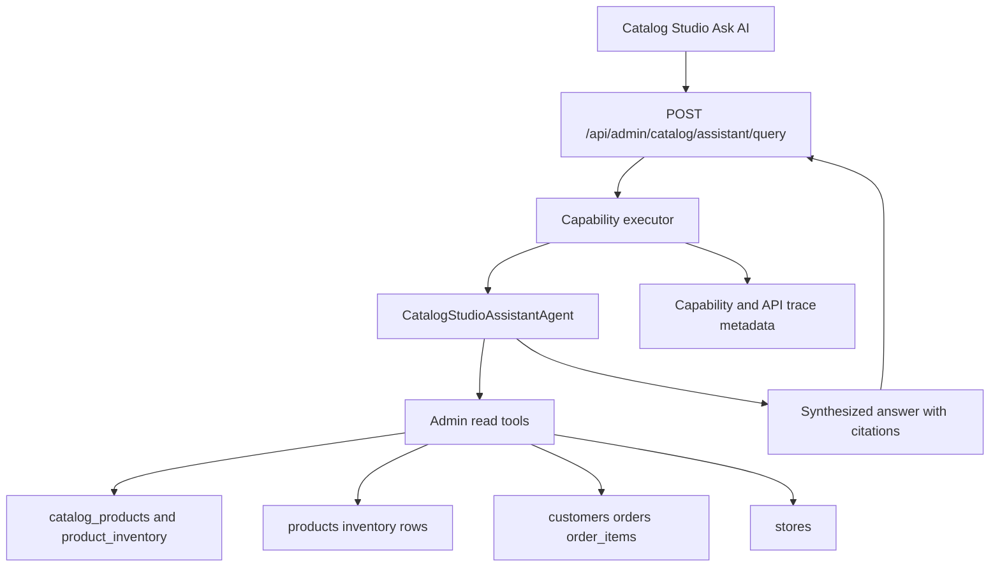

# Ground Catalog Chat With Admin Agent - Plan

## Goal Capsule

- **Objective:** Make Catalog Chat in Catalog Studio answer free-form admin questions by running a real agent over backend store, catalog, product, inventory, customer, and order data instead of returning deterministic template summaries.
- **Authority:** The user's request is primary. Existing Catalog Studio auth, capability registry, and read-only mutation boundaries remain binding.
- **Evidence:** A live browser check at `/catalog-studio` showed real product rows in the UI, but chat ignored specific product and customer questions and returned unrelated inventory-risk templates from the current bounded text endpoint.
- **Execution profile:** Implement behind the existing `POST /api/admin/catalog/assistant/query` frontend contract, then broaden tests and docs.
- **Stop conditions:** Stop if implementing customer/order access requires a product decision about whether catalog admins may inspect customer PII beyond summarized purchase/order data.

---

## Product Contract

### Summary

Catalog Chat should behave like an admin assistant that can interrogate real Sterling Hollis backend data. It should call bounded read tools, synthesize an answer from those tool results, and cite the records it used.

### Problem Frame

The current Catalog Studio text assistant is not agentic. `app.routers.admin_catalog.query_catalog_assistant` records `selected_agent="CatalogStudioAssistant"`, but it delegates directly to `app.services.catalog_voice_tools.answer_catalog_question`. That service uses keyword checks and SQL summary templates, so a question about Maison Arctis products or Tom Ford customers can return an unrelated store inventory or product candidate. This creates an agent/API parity gap and makes the UI label "Ask AI" misleading.

### Requirements

**Agent behavior**

- R1. Catalog Chat must run a provider-backed Catalog Studio admin agent or an equivalent tool-calling orchestration path for free-form questions.
- R2. The agent must use bounded read-only tools for store, catalog product, inventory, customer, and order data rather than placing raw database access in a prompt.
- R3. The agent must answer from tool results only, cite the records used, and ask a clarification or report no matching data when tools return no evidence.

**Data grounding**

- R4. Product questions must resolve real `catalog_products`, `product_inventory`, and legacy `products` rows by title, brand, category, lifecycle status, and store/inventory state.
- R5. Customer questions must resolve real `customers`, `orders`, and `order_items` rows through an approved admin read path with PII minimization in citations.
- R6. Store and inventory questions must preserve current store-wide summary coverage while allowing more specific product/store filters.

**Frontend and operations**

- R7. The existing `POST /api/admin/catalog/assistant/query` route and `CatalogVoiceToolResult` response shape must remain compatible; additive diagnostic fields are allowed.
- R8. Provider-unavailable fallback must be explicit in status, selected tool, or message and must not masquerade as an agent-authored answer.
- R9. Capability metadata, API trace metadata, docs, and generated capability maps must identify the actual agent/tool path.

### Acceptance Examples

- AE1. Given a catalog admin asks, "Name two Maison Arctis products and tell me their categories and lifecycle statuses," Catalog Chat returns real Maison Arctis catalog products with category, lifecycle status, and product citations.
- AE2. Given a catalog admin asks, "Which customers bought Tom Ford Black Trousers?", Catalog Chat searches customer/order data for matching product rows and either returns cited customer/order summaries or states that no matching purchases were found.
- AE3. Given a catalog admin asks, "Which stores have low stock for published handbags?", Catalog Chat returns store and inventory rows filtered to published handbags, not a generic risk leaderboard.
- AE4. Given an unsupported or ambiguous question, Catalog Chat asks one focused clarification or explains which data domains it can read.
- AE5. Given `OPENAI_API_KEY` or agent runtime configuration is absent, Catalog Chat returns a transparent fallback response and telemetry marks the non-agent path.

---

## Planning Contract

### Key Technical Decisions

- KTD1. Introduce a Catalog Studio admin agent instead of reusing `StorefrontShoppingAgent`. The storefront agent prompt correctly forbids customer/private admin data, while Catalog Chat needs a catalog-admin read profile.
- KTD2. Build typed admin read tools as the agent boundary. Tools should wrap existing services and SQLAlchemy projections, return bounded JSON, and create `CatalogVoiceCitation` objects for every cited record.
- KTD3. Keep `/api/admin/catalog/assistant/query` stable and swap the implementation behind it. The frontend can continue posting `question` and `query_scopes`, while backend behavior becomes genuinely agentic.
- KTD4. Separate customer/order read authorization from public shopper account tools. Catalog admin customer intelligence should be a read-only admin capability or a clearly scoped sub-capability, not a reuse of backend-derived shopper identity paths.
- KTD5. Preserve deterministic summaries as fallback tools, not as the default answer path. Existing inventory summaries are useful evidence sources, but they should be invoked by the agent and labeled when used directly as fallback.
- KTD6. Extend capability and trace metadata so `selected_agent`, `selected_tool`, tool calls, citations, latency, provider request IDs, and fallback reasons are visible across API traces and tests.

### High-Level Technical Design

### Assumptions

- Catalog admins are authorized to read bounded customer/order summaries for merchandising and catalog support questions, with emails and phones omitted from assistant citations unless a future product decision explicitly permits them.
- The implementation can use the existing `strands-agents[openai]` dependency and OpenAI-backed model settings already present in the backend.
- The deployed frontend calls `POST /api/admin/catalog/assistant/query` for the Catalog Chat text path.

### Scope Boundaries

- This plan does not add write-capable chat actions for publishing, archiving, updating inventory, or sending customer communications.
- This plan does not change the Realtime voice draft command contract except to share read tools where useful.
- This plan does not expose customer lookup to public shopper chat or public MCP surfaces.
- This plan does not require a frontend redesign unless the UI wants to display additive trace/tool metadata.

### Risks & Dependencies

- **Customer privacy:** Customer/order tools must redact or summarize PII and follow existing trace redaction limits.
- **Product identity mismatch:** `order_items.product_id` points at legacy `products`, while Catalog Studio displays normalized `catalog_products`; product resolution must bridge or clearly report when no order-linked legacy row exists.
- **Provider availability:** Production needs `OPENAI_API_KEY` and a working agent runtime; fallback behavior must be observable and honest.
- **Latency:** Multi-tool agent runs can be slower than deterministic summaries; tools need limits, timeouts, and clear no-result handling.

---

## Implementation Units

### U1. Characterize Current Failure And Target Contracts

- **Goal:** Add failing tests that capture the live failure mode and the expected grounded behavior.
- **Requirements:** R1, R3, R4, R5, R7, AE1, AE2, AE3.
- **Dependencies:** None.
- **Files:** `tests/test_catalog_voice_tools.py`, `tests/test_frontend_api_contract.py`, `docs/frontend-api.md`.
- **Approach:** Add tests for product-specific, customer/order-specific, and filtered inventory questions against seeded data. Keep current low-stock tests, but assert that unrelated product/customer questions do not fall through to generic inventory templates.
- **Patterns to follow:** Existing `/api/admin/catalog/assistant/query` tests in `tests/test_catalog_voice_tools.py` and capability metadata assertions in `tests/test_frontend_api_contract.py`.
- **Test scenarios:** Ask for two named-brand catalog products and verify returned text plus citations use matching `CatalogProduct` rows; ask for customers/orders for a named product and verify customer/order evidence or a cited no-match outcome; ask an unsupported query and verify clarification/no-evidence behavior rather than inventory fallback.
- **Verification:** The tests fail against `answer_catalog_question` keyword-template behavior before the agent implementation lands.

### U2. Add Bounded Admin Assistant Read Tools

- **Goal:** Create reusable read tools for catalog/product, inventory/store, and customer/order evidence.
- **Requirements:** R2, R4, R5, R6, AE1, AE2, AE3.
- **Dependencies:** U1.
- **Files:** `app/services/catalog_assistant_tools.py`, `app/services/catalog_voice_tools.py`, `app/catalog/service.py`, `app/services/catalog_admin.py`, `app/services/lookup.py`, `tests/test_catalog_voice_tools.py`.
- **Approach:** Implement typed functions such as catalog product search/detail, product inventory lookup, store inventory summary with filters, customer purchase lookup, and store resolution. Return bounded dictionaries and `CatalogVoiceCitation` lists. Reuse `ProductFilters`, `list_products`, `resolve_store`, and customer/order helpers where they already fit; add small projections only where existing services lack admin-safe output.
- **Patterns to follow:** `app.services.chat.strands_tools.build_storefront_tools` for tool wrappers and `app.services.catalog_voice_tools._catalog_inventory_summary` for citation shape.
- **Test scenarios:** Verify product search honors title/brand/category/lifecycle filters; verify inventory tools can filter by product and store; verify customer purchase lookup joins `Order`, `OrderItem`, `Product`, `Customer`, and `Store` while redacting email/phone in citations; verify all tools enforce limits.
- **Verification:** Tool tests return deterministic evidence objects independent of provider availability.

### U3. Implement CatalogStudioAssistantAgent

- **Goal:** Add a provider-backed admin assistant that selects read tools and synthesizes grounded answers.
- **Requirements:** R1, R2, R3, R8, AE1, AE2, AE4, AE5.
- **Dependencies:** U2.
- **Files:** `app/services/catalog_assistant_agent.py`, `app/services/catalog_voice_tools.py`, `app/config.py`, `.env.example`, `README.md`, `tests/test_catalog_voice_tools.py`.
- **Approach:** Build a Catalog Studio admin agent with a system prompt that limits actions to read-only tools, requires citations, and forbids inventing records. Prefer the existing Strands/OpenAI model path already used by storefront chat, with a new or documented Catalog Studio assistant model setting if the existing `catalog_studio_responses_model` is not appropriate. Provide a transparent deterministic fallback when provider configuration is missing.
- **Patterns to follow:** `app.services.chat.strands_agent.build_storefront_shopping_agent`, `app.services.chat.strands_orchestrator.run_storefront_shopping_agent`, and Catalog Studio Responses configuration in `app.services.catalog_ai`.
- **Test scenarios:** Stub the agent to call multiple tools and verify response synthesis uses tool outputs; simulate provider unavailable and verify fallback status/metadata; verify prompt/tool schema excludes write tools and customer PII fields.
- **Verification:** Text assistant responses come from tool results in tests and do not call deterministic keyword templates unless fallback metadata is present.

### U4. Route Text Catalog Chat Through The Agent

- **Goal:** Replace the direct `answer_catalog_question` route path with the new agent orchestration while preserving the frontend response contract.
- **Requirements:** R1, R7, R8, R9, AE1, AE5.
- **Dependencies:** U3.
- **Files:** `app/routers/admin_catalog.py`, `app/services/catalog_voice_tools.py`, `app/services/capability_executor.py`, `app/services/capability_tracing.py`, `tests/test_catalog_voice_tools.py`, `tests/test_api_trace_catalog.py`.
- **Approach:** Keep `CatalogAssistantQueryRequest` and `CatalogVoiceToolResult`, but have `query_catalog_assistant` execute `run_catalog_assistant_query`. Populate `selected_agent` with the real agent, `selected_tool` with the primary read tool or `catalog_assistant_agent`, and citations from tool output. Attach provider/fallback attributes to the existing capability/API trace path.
- **Patterns to follow:** Capability executor usage in `app.routers.admin_catalog.query_catalog_assistant` and selected-tool execution spans in `app.services.chat.orchestrator`.
- **Test scenarios:** Verify route metadata still reports `catalog_admin.assistant.query`; verify selected agent/tool metadata changes from static template behavior to the actual agent/tool path; verify API traces include tool names and no raw customer PII.
- **Verification:** The endpoint stays backward compatible for the frontend while returning grounded answers for U1 scenarios.

### U5. Update Capability Policy For Admin Customer Reads

- **Goal:** Make customer/order reads available to the Catalog Studio assistant through explicit policy instead of accidental access.
- **Requirements:** R5, R9, AE2.
- **Dependencies:** U2.
- **Files:** `app/services/capabilities.py`, `app/services/capability_executor.py`, `docs/capability-map.md`, `tests/test_capability_registry.py`, `tests/test_frontend_api_contract.py`.
- **Approach:** Either add a `catalog_admin.customer.read` capability or expand `catalog_admin.assistant.query` metadata to name customer/order read scope. The final choice should keep public shopper and associate customer capabilities separate and keep send-capable actions out of Catalog Chat.
- **Patterns to follow:** Existing `associate.customer.lookup`, `shopper.account.order_status`, and `catalog_admin.assistant.query` registry entries.
- **Test scenarios:** Verify catalog admin can use read-only customer/order tools through Catalog Chat; verify anonymous shoppers and public MCP cannot access those tools; verify send-capable customer communication tools remain unavailable.
- **Verification:** Capability map and tests make the customer-data boundary auditable.

### U6. Refresh Docs, OpenAPI, And Deployment Readiness

- **Goal:** Document the real assistant behavior, configuration, fallback, and citation semantics.
- **Requirements:** R7, R8, R9, AE5.
- **Dependencies:** U4, U5.
- **Files:** `docs/frontend-api.md`, `docs/frontend-openapi.yaml`, `docs/openapi.json`, `docs/capability-map.md`, `scripts/export_openapi.py`, `README.md`, `.env.example`, `deploy/docker-compose.prod.yml`.
- **Approach:** Regenerate API docs and capability map after metadata changes. Document that Catalog Chat is agent-backed when provider configuration is present and explicit when fallback mode is active. Add production verification notes for a product query, a customer/order query, and a filtered inventory query.
- **Patterns to follow:** Generated docs expectations in `tests/test_frontend_api_contract.py` and Catalog Studio configuration docs in `README.md`.
- **Test scenarios:** Verify generated OpenAPI keeps the admin route current and secured; verify capability map includes the assistant route and any new customer-read capability; verify docs mention fallback and citation behavior.
- **Verification:** Docs and generated artifacts match the implemented contract.

---

## Verification Contract

| Gate | Applicability | Done signal |
|---|---|---|
| `pytest tests/test_catalog_voice_tools.py` | U1-U4 | Product, customer/order, inventory, fallback, and route behavior pass. |
| `pytest tests/test_capability_registry.py tests/test_frontend_api_contract.py` | U5-U6 | Capability policy, OpenAPI metadata, and generated docs expectations pass. |
| `pytest tests/test_api_trace_catalog.py tests/test_api_trace_chat.py` | U4 | Trace metadata remains redacted and comparable with chat/capability paths. |
| Browser smoke on `/catalog-studio` | Whole plan | The same Maison Arctis and customer/order questions return grounded answers or accurate no-result responses, not generic inventory templates. |

---

## Definition of Done

- Catalog Chat text calls the real Catalog Studio admin agent when provider configuration is available.
- The agent uses bounded backend read tools for catalog, product, inventory, store, customer, and order evidence.
- Answers cite real records and avoid unrelated canned inventory responses.
- Provider-unavailable fallback is transparent and observable.
- Customer/order access is covered by explicit admin read policy and redaction tests.
- Existing frontend route and response compatibility are preserved.
- OpenAPI, capability map, README, and frontend docs reflect the new behavior.
- Dead-end experimental code and obsolete canned-default branches are removed or demoted to explicit fallback.

---

## Sources & Research

- Live browser check of `/catalog-studio` on 2026-06-29: Catalog Studio loaded 1,425 products, but the assistant answered a Maison Arctis product question with `Christian Louboutin Navy Clutch` inventory and answered a Tom Ford customer question with generic store inventory risk.
- `app/routers/admin_catalog.py` defines `POST /api/admin/catalog/assistant/query` and currently delegates to `answer_catalog_question`.
- `app/services/catalog_voice_tools.py` contains keyword detection, deterministic catalog/inventory templates, and the current `CatalogVoiceToolResult` citation shape.
- `app/services/chat/strands_agent.py` and `app/services/chat/strands_tools.py` provide the existing provider-backed storefront agent pattern, but the storefront prompt forbids private customer/admin data.
- `app/models.py` contains the relevant `CatalogProduct`, `ProductInventory`, `Product`, `Customer`, `Order`, and `OrderItem` tables.
- `app/services/capabilities.py` and `docs/capability-map.md` define current capability boundaries and already list `catalog_admin.assistant.query`.
- `docs/plans/2026-06-22-001-refactor-agent-api-parity-plan.md` established the broader direction that admin assistant calls should share capability identity and trace topology with agent paths.
